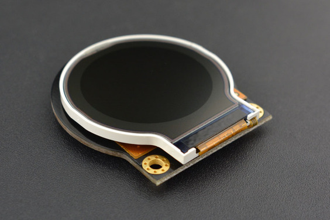

# DFRobot_ST7687S
- [中文版](./README_CN.md)

This is a 2.2” TFT LCD Display Module(30Pin soldered) with a resolution of 128 * 128, which can be used to display colorful patterns and characters in a cycle and realize dynamic display effect. Based on ST7687S chip, the module is compatible with TFT 8K3963FPC. It does not include TP. 



## Product Link (https://www.dfrobot.com/product-1794.html)
    DFR0529: Fermion: 2.2” TFT SPI Interface LCD Display (Breakout)

## Table of Contents

* [Summary](#summary)
* [Installation](#installation)
* [Methods](#methods)
* [Compatibility](#compatibility)  
* [History](#history)
* [Credits](#credits)

## Summary

1. Input commands to draw different patterns on the LCD.
2. Support different drawings in the screen, including point, line, circle, filled circle, rectangle, filled rectangle, triangle, filled triangle, rounded rectangle, filled rounded rectangle. <br>
3. Supports English characters. <br>
4. SPI interface <br>


## Installation

Download the library ZIP file and unzip it to the Arduino folder of the library.
(If you haven't download DFRobot display library before, you need to download it first to drive (https://github.com/DFRobot/DFRobot_Display))

## Methods

```C++
  /**
   * @fn begin
   * @brief Init function, initialize some parameters displayed on the screen, and enable display
   * @return Error code
   */
  int16_t begin();
  
  /**
   * @fn drawPixel
   * @brief Draw point function, draw a point on the screen
   * @param x x-coordinate
   * @param y y-coordinate
   * @param color pixel color
   */
  void drawPixel(int16_t x, int16_t y, uint16_t color);
  
  /**
   * @fn fillScreen
   * @brief Fill screen with a color
   * @param color data in RGB565 format
   */
  void fillScreen(uint16_t color);    
  
  /**
   * @fn drawHLine
   * @brief Draw a horizontal line with the starting point（x，y）
   * @param x The coordinate of the starting point x on the x axis. Take the top left corner of the screen as the origin. 
   * @param y The coordinate of the starting point y on the y axis
   * @param width The line width
   * @param color The line color
   */
  void drawHLine(int16_t x, int16_t y, int16_t width, uint16_t color);

  /**
   * @fn drawVLine
   * @brief Draw a vertical line with the starting point（x，y）
   * @param x The coordinate of the starting point x on the x axis. Take the top left corner of the screen as the origin.
   * @param y The coordinate of the starting point y on the y axis 
   * @param width  The line width
   * @param color  The line color
   */
  void drawVLine(int16_t x, int16_t y, int16_t height, uint16_t color);
```


## Compatibility

MCU                | Work Well | Work Wrong | Untested  | Remarks
------------------ | :----------: | :----------: | :---------: | -----
FireBeetle-ESP32  |      √       |             |            | 
FireBeetle-ESP8266  |      √       |             |            | 
FireBeetle-BLE4.1 |       √      |             |            | 
Arduino uno |       √      |             |            | 
Arduino leonardo |      √       |             |            | 

## History

- 2022/3/25 - Version 1.0.0 released.

## Credits

Written by fengli(li.feng@dfrobot.com), 2022.03.25 (Welcome to our [website](https://www.dfrobot.com/))
