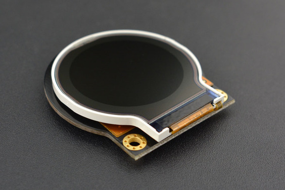

# DFRobot_ST7687S
- [English Version](./README.md)

2.2寸液晶显示屏(圆屏)，点阵128 * 128度高清分析，常用在手机、手表、仪器仪表、医疗设置、数码、工业产品中。兼容TFT 8K3963FPC, IC为ST7687S，不含TP，焊接30PIN。




## 产品链接 (https://www.dfrobot.com/product-1794.html)
    DFR0529: Fermion: 2.2” TFT SPI Interface LCD Display (Breakout)

## 目录

  * [概述](#概述)
  * [库安装](#库安装)
  * [方法](#方法)
  * [兼容性](#兼容性)
  * [历史](#历史)
  * [创作者](#创作者)
## 概述

向LCD上输入命令并绘制不同的图形。<br>
支持在屏幕上绘制不同的图形，包括点、线、圆、填圆、<br>
矩形，填充矩形，三角形，填充三角形，圆角矩形，填充圆角矩形。<br>
支持英文字符。<br>
SPI接口<br>

## 库安装

使用此库前，请首先下载库文件，将其粘贴到\Arduino\libraries目录中，然后打开examples文件
夹并在该文件夹中运行演示。<br>
如果您以前没有下载过DFRobot显示库，您需要先下载它以驱动(https://github.com/DFRobot/DFRobot_Display))<br>
## 方法

```C++

  /**
   * @fn begin
   * @brief 初始化函数,初始化屏幕显示的一些参数,并开启显示
   * @return 错误码
   */
  int16_t begin();
  
  /**
   * @fn drawPixel
   * @brief 画点函数,在屏幕的某点画一个点
   * @param x x坐标
   * @param y y坐标
   * @param color 像素点颜色
   */
  void drawPixel(int16_t x, int16_t y, uint16_t color);
  
  /**
   * @fn fillScreen
   * @brief 用某个颜色填充屏幕
   * @param color RGB565格式的数据
   */
  void fillScreen(uint16_t color);    
  
  /**
   * @fn drawHLine
   * @brief 在屏幕的X方向画直线
   * @param x 以屏幕左上角为原点,线段在x轴的起点
   * @param y 线段在y轴的起点
   * @param width 线段的宽度
   * @param color 线段的颜色
   */
  void drawHLine(int16_t x, int16_t y, int16_t width, uint16_t color);

  /**
   * @fn drawVLine
   * @brief 在屏幕的Y方向画直线
   * @param x 以屏幕左上角为原点,线段在x轴的起点
   * @param y 线段在y轴的起点
   * @param width 线段的宽度
   * @param color 线段的颜色
   */
  void drawVLine(int16_t x, int16_t y, int16_t height, uint16_t color);

```


## 兼容性

主板                | Work Well    | Work Wrong   | Untested    | Remarks
------------------ | :----------: | :----------: | :---------: | -----
FireBeetle-ESP32  |      √       |             |            | 
FireBeetle-ESP8266  |      √       |             |            | 
FireBeetle-BLE4.1 |       √      |             |            | 
Arduino uno |       √      |             |            | 
Arduino leonardo |      √       |             |            | 
## 历史


- 2022/3/25 - Version 1.0.0 released.


## 创作者

Written by fengli(li.feng@dfrobot.com), 2022.03.25 (Welcome to our [website](https://www.dfrobot.com/))